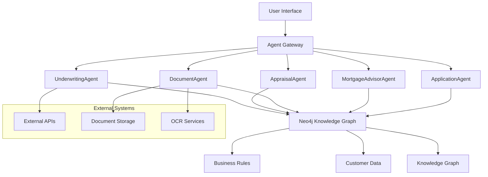

# V1 System Architecture Specification

## Overview

The V1 Production Agentic Mortgage System is built on a **modular, data-driven architecture** that leverages LangGraph for agent orchestration and Neo4j for business rule management.

## 🏗️ **High-Level Architecture**



## 🧩 **Component Architecture**

### **1. Agent Layer**
```
src/agentic_mortgage/agents/
├── application_agent/          # Application intake & URLA
├── mortgage_advisor_agent/     # Customer guidance
├── document_agent/             # Document verification
├── appraisal_agent/           # Property valuation
├── underwriting_agent/        # Credit decisions
└── shared/                    # Common utilities
```

### **2. Tool Layer**
```
Each agent/tools/
├── tool_1.py                  # Neo4j-powered business logic
├── tool_2.py                  # Data-driven operations
├── ...
└── __init__.py               # Tool aggregation
```

### **3. Data Layer**
```
src/agentic_mortgage/utils/db/
├── neo4j_connection.py       # Database connectivity
├── mortgage_data_loader.py   # Data initialization
└── rules/                    # Business rule modules
    ├── application_intake/
    ├── document_verification/
    ├── property_appraisal/
    ├── underwriting/
    └── ...
```

## 🔄 **Data Flow Architecture**

### **Request Processing Flow**
1. **User Input** → Agent Gateway
2. **Agent Selection** → Route to appropriate agent
3. **Tool Execution** → Query Neo4j for business rules
4. **Business Logic** → Apply data-driven rules
5. **Response Generation** → Return structured results
6. **State Management** → Update workflow state

### **Data Persistence Flow**
```
User Data → Agent Processing → Neo4j Storage → Knowledge Graph Updates
```

## 📊 **Neo4j Knowledge Graph Schema**

### **Core Node Types**
- `Person` - Customer information
- `Application` - Mortgage applications
- `Document` - Document metadata
- `Property` - Property information
- `BusinessRule` - Data-driven rules
- `Agent` - Agent metadata

### **Relationship Types**
- `APPLIES_FOR` - Person → Application
- `REQUIRES` - Application → Document
- `VERIFIES` - Document → Property
- `GOVERNED_BY` - Process → BusinessRule
- `PROCESSES` - Agent → Application

### **Rule Storage Pattern**
```cypher
CREATE (rule:BusinessRule {
    rule_id: "UNIQUE_ID",
    category: "RULE_CATEGORY",
    rule_type: "RULE_TYPE",
    criteria: {...},
    actions: {...},
    metadata: {...}
})
```

## 🛠️ **Technology Stack**

### **Core Framework**
- **LangGraph**: Agent orchestration and workflow management
- **LangChain**: LLM integration and tool binding
- **Neo4j**: Knowledge graph and business rules storage
- **Python 3.11+**: Primary development language

### **LLM Integration**
- **OpenAI GPT-4**: Primary reasoning model
- **Anthropic Claude**: Alternative model support
- **Model Switching**: Runtime model selection capability

### **Dependencies**
```python
# Core LangGraph & LangChain
langgraph>=0.2.0
langchain>=0.3.0
langchain-core>=0.3.0
langchain-openai>=0.2.0

# Neo4j Integration
neo4j>=5.0.0
langchain-neo4j>=0.1.0

# Configuration & Validation
pydantic>=2.0.0
pydantic-settings>=2.0.0
PyYAML>=6.0
```

## 🔧 **Configuration Architecture**

### **Configuration Hierarchy**
1. **Environment Variables** (highest priority)
2. **config.yaml** (application defaults)
3. **Agent-specific prompts.yaml** (agent configuration)
4. **Neo4j business rules** (runtime configuration)

### **Configuration Structure**
```yaml
# config.yaml
neo4j:
  uri: "bolt://localhost:7687"
  username: "neo4j"
  password: "${NEO4J_PASSWORD}"
  database: "mortgage"

agents:
  application_agent:
    model: "gpt-4"
    temperature: 0.1
    max_tokens: 2048
```

## 🔐 **Security Architecture**

### **Authentication & Authorization**
- **Environment-based secrets** management
- **Role-based access control** for different agent capabilities
- **API key rotation** support
- **Audit logging** for all agent actions

### **Data Protection**
- **PII encryption** in Neo4j storage
- **Secure document handling** with temporary storage
- **HTTPS/TLS** for all external communications
- **Input validation** and sanitization

## 🚀 **Deployment Architecture**

### **Development Environment**
```
Local Machine
├── Python Virtual Environment
├── Local Neo4j Desktop Instance
├── Environment Variables (.env)
└── LangGraph Studio (optional)
```

### **Production Environment** (Future)
```
Cloud Infrastructure
├── Container Orchestration (Kubernetes/Docker)
├── Managed Neo4j (Neo4j Aura)
├── Load Balancer
├── Monitoring & Logging
└── CI/CD Pipeline
```

## 📈 **Scalability Architecture**

### **Horizontal Scaling**
- **Stateless agents** enable multiple instances
- **Neo4j clustering** for database scalability
- **Load balancing** across agent instances
- **Async processing** for long-running operations

### **Performance Optimization**
- **Connection pooling** for Neo4j
- **Caching layers** for frequently accessed rules
- **Lazy loading** of business rules
- **Streaming responses** for better UX

## 🔍 **Monitoring & Observability**

### **Metrics Collection**
- **Agent performance** metrics
- **Tool execution** success rates
- **Neo4j query** performance
- **LLM token usage** tracking

### **Logging Strategy**
- **Structured logging** (JSON format)
- **Agent action logs** with context
- **Error tracking** and alerting
- **Business process** audit trails

### **Health Checks**
- **Agent availability** checks
- **Neo4j connectivity** monitoring
- **LLM service** health validation
- **End-to-end workflow** testing

## 🧪 **Testing Architecture**

### **Test Categories**
1. **Unit Tests** - Individual tool validation
2. **Integration Tests** - Agent + Neo4j interactions
3. **End-to-End Tests** - Complete workflow testing
4. **Performance Tests** - Load and stress testing
5. **LangSmith Evaluations** - LLM/agent quality assessment

### **Test Data Management**
- **Synthetic test data** generation
- **Isolated test databases** (Neo4j)
- **Mock external services** for testing
- **Reproducible test scenarios**

## 🔄 **Workflow State Management**

### **State Schema**
```python
class MortgageWorkflowState(BaseModel):
    application_id: str
    current_agent: str
    workflow_stage: str
    customer_data: Dict
    documents: List[Document]
    decisions: List[Decision]
    next_actions: List[str]
```

### **State Persistence**
- **Neo4j storage** for permanent state
- **Memory-based** for session state
- **State transitions** logged for audit
- **Rollback capability** for error recovery

## 📋 **API Architecture**

### **Internal Agent APIs**
```python
# Agent Interface
class AgentInterface:
    def invoke(self, input: Dict) -> Dict
    def stream(self, input: Dict) -> Iterator[Dict]
    def get_tools(self) -> List[Tool]
    def validate_config(self) -> bool
```

### **External Integration Points**
- **Document upload** endpoints
- **Status query** APIs
- **Webhook notifications** for status updates
- **Third-party service** integrations

This architecture specification provides the foundation for understanding, deploying, and scaling the V1 production agentic mortgage system.
